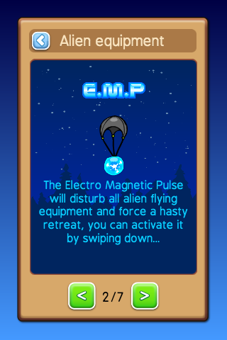

# Menus and dialogs

One of the basic things most games need is a menu and dialog system.
This repository provides a set of classes to handle the basic menus.

The menus can be displayed in game or on top of a dedicated menu
background, the demo uses a simple gradient as a background.

## Modals

A modal is a menu which is shown on top of another view, if a menu
is shown as a model then the user is required to take action. Usually 
the backgound is darkened to signify that the only available options
are on the active modal.

Every menu can be shown as a modal or a standard menu.

## Navigation

There are several different buttons to navigate trough the menus.
On the title bar there can be a back button on the left side or
a close button on the right side.

The close button is usually displayed when the menus is shown as
a modal, the back button is usually used to navigate through a menu 
tree.

Dialogs -like confirm or alert- have one or more buttons on the bottom
of the dialog.

Menus have a list of options. The standard behaviour is to hide
the menu when a menu option is clicked however it's possible to
overrule this bahaviour and let the menu persist when an option
is selected. This could be used for example to let the user select
a background which could be displayed behind the menu when an
option is selected.

## Transitions

This demo offsers several transitions to show or hide menus:
sliding, scaling and fading.

## 9-Slice images

All element which make up the menus and dialogs are based on 9-slice images.

<table>
	<tr>
		<th>Images</th>
		<th>Size</th>
		<th>Purpose</th>
		<th>Path</th>
	</tr>
	<tr>
		<td></td>
		<td>70x70</td>
		<td>Background</td>
		<td>resources/images/ui/background.png</td>
	</tr>
	<tr>
		<td></td>
		<td>70x70</td>
		<td>Item background, content background</td>
		<td>resources/images/ui/item.png</td>
	</tr>
	<tr>
		<td></td>
		<td>70x70</td>
		<td>Menu item background</td>
		<td>resources/images/ui/buttonItem.png</td>
	</tr>
	<tr>
		<td></td>
		<td>70x70</td>
		<td>Title background</td>
		<td>resources/images/ui/title.png</td>
	</tr>
	<tr>
		<td></td>
		<td>70x70</td>
		<td>Content frame</td>
		<td>resources/images/ui/contentBorder.png</td>
	</tr>
	<tr>
		<td> </td>
		<td>70x70</td>
		<td>Button background, up and down state</td>
		<td>resources/images/ui/button1Down.png</td>
	</tr>
	<tr>
		<td> </td>
		<td>70x70</td>
		<td>Button background, up and down state</td>
		<td>resources/images/ui/button2Down.png</td>
	</tr>
	<tr>
		<td> </td>
		<td>70x70</td>
		<td>Button background, up and down state</td>
		<td>resources/images/ui/button2Down.png</td>
	</tr>
	<tr>
		<td></td>
		<td>40x40</td>
		<td>Icon for back button</td>
		<td>resources/images/ui/buttonBack.png</td>
	</tr>
	<tr>
		<td></td>
		<td>40x40</td>
		<td>Icon for close button</td>
		<td>resources/images/ui/buttonClose.png</td>
	</tr>
	<tr>
		<td></td>
		<td>576x1024</td>
		<td>Menu background</td>
		<td>resources/images/ui/menuBackground.png</td>
	</tr>
</table>

## Configuration

Many of the look and behaviour properties can be configured with a global configuration file,
`src.constants.menuConstants.js`.
All images names and paths which are used in the menu system are defined here.

### DialogBackgroundView Class

The `DialogBackgroundView` class is the super class for all dialogs listed here. It's purpose is to handle
transitions, create an opaque background and prevent clicks on items behind the dialog.

Parameters
 + `superview {View}` ---The view which contains this menu, could be a menu background or the game view.
 + `showTransitionMethod {number} = menuConstants.transitionMethod.SLIDE` ---Optional, method to use for showing
 + `showTransitionTime {number} = menuConstants.DIALOG.SHOW_TRANSITION_TIME` ---Optional, transition duration for showing
 + `hideTransitionMethod {number} = menuConstants.transitionMethod.SLIDE` ---Optional, method to use for hiding
 + `hideTransitionTime {number} = menuConstants.DIALOG.HIDE_TRANSITION_TIME` ---Optional, transition duration for hiding

#### Methods

__show([cb])__

Parameters
 + `cb {function}` ---Optional, a callback invoked when the menu is visible.
Returns
 {object} ---Returns the reference to the menu.

__hide([cb])__

Parameters
 + `cb {function}` ---Optional, a callback invoked when the menu is hidden.
Returns
 {object} ---Returns the reference to the menu.

### MenuView Class

extends `DialogBackgroundView`

 
*Screenshot of the main menu*

Parameters
 + `superview {View}` ---The view which contains this menu, could be a menu background or the game view.
 + `title {string}` ---The title displayed in the title bar of the menu
 + `items {array}` ---A list of menu items, the structure of the item is:
  + `item {string}` ---The display title of the item
  + `action {string|function}` ---If it's a string then the value will be emitted else the function is invoked on clicking.
  + `persist {boolean}` ---Optional, If this values is `true` then the menu will not be hidden when the option is clicked.
  + `text {string}` ---Optional, display a text instead of a clickable option.
  + `image {string}` ---Optional, the path to an image to display instead of a clickable option.
  + `width {number} = 70` ---Optional, the width of the image.
  + `height {number} = 70` ---Optional, the height of the image.
  + `align {string}` ---Optional, the horizontal alignment of the text or image, the default is `center` options are: `left`, `center` and `right`.

~~~
import src.views.ui.MenuView as MenuView;

new MenuView({
	superview: this,
	title: 'Main menu',
	items: [
		{item: 'Menus', action: 'Menus'},
		{item: 'Setup', action: bind(this, 'onSetup')}
	]
}).show();
~~~

### TextDialogView Class

extends `DialogBackgroundView`

#### Events

If the action is a string then that string is emitted when the option is clicked.

__Hide__

Emitted then the menu is hidden.

### TextDialogView Class

The `TextDialogView` class is a generic dialog which can be used to create a confirm or alert dialog.

 
*A screenshot of a confirm dialog using the `TextDialogView` class*

 
*A screenshot of an alert dialog using the `TextDialogView` class*

Parameters
 + `superview {View}` ---The view which contains this menu, could be a menu background or the game view.
 + `title {string}` ---The title displayed in the title bar of the menu.
 + `text {string}` ---The text displayed.
 + `width {number}` ---Optional, the default value is the available screen width minus 80 pixels.
 + `height {number} = 400` ---Optional, the width of the dialog.
 + `modal {boolean}` ---Optional, if true then the background will be darkened.
 + `buttons {array}` ---A list of buttons displayed at the bottom of the dialog, the structure of the button item is:
  + `title {string}` ---The title of the button.
  + `width {number}` ---The horizontal size of the button.
  + `style {string}` ---A string representing the style of the button, the styles are configured in `src.constants.menuConstants`.

~~~
import src.views.ui.TextDialogView as TextDialogView;

new TextDialogView({
	superview: this,
	title: 'Alert modal',
	text: 'This menu is displayed on top of the dialogs menu',
	modal: true,
	buttons: [
		{
			title: 'Ok',
			width: 160,
			style: 'GREEN'
		}
	]
}).show();
~~~

#### Methods

__setText(text)__

Parameters
 + `text {string}` ---Sets the text of the dialog

__setTitle(text)__

Parameters
 + `text {string}` ---Sets the title of the dialog

### TutorialAnimationView Class

extends `DialogBackgroundView`

The `TutorialAnimationView` is a dialog to display a short animation.

The [SpriteView](http://docs.gameclosure.com/api/ui-spriteview.html) class is used to play the animation.

 
*A screenshot of a tutorial dialog*

Parameters
 + `superview {View}` ---The view which contains this menu, could be a menu background or the game view.
 + `title {string}` ---The title displayed in the title bar of the menu.
 + `url {string}` ---The path to the animation.
 + `animation {string}` ---The animation which is played.

### DocumentView Class

The `DocumentView` class allows you to display texts and images. You can define a single or multiple
pages. When the text is too long to fit on a single page then scrolling is enabled. There are a number
of options to style the text by selecting a background color, font family, font size, font color or alignment.

 
*A screenshot of a dialog with text and images*

Parameters
 + `superview {View}` ---The view which contains this menu, could be a menu background or the game view.
 + `title {string}` ---The title displayed in the title bar of the menu.
 + `style {object}` ---Optional, the default style for texts and titles, the structure is as follows:
  + `title {object}` ---Optional, the default title style.
   + `fontFamily {string}` ---Optional, the font family of the title.
   + `size {number}` ---Optional, the font size of the title.
   + `color {string}` ---Optional, the color of the title.
   + `align {string}` ---Optional, the alignment of the title, valid values are: 'left', 'center' or 'right'
  + `text {object}` ---Optional, the default text style.
   + `fontFamily {string}` ---Optional, the font family of the text.
   + `size {number}` ---Optional, the font size of the text.
   + `color {string}` ---Optional, the color of the text.
   + `align {string}` ---Optional, the alignment of the text, valid values are: 'left', 'center', 'justify' or 'right'
 + `items {array}` ---Optional, a list of settings objects for the page select buttons with the following structure:
  + `type {string}` ---The type valid values are: 'prev', 'next', 'info' where 'info' shows the current and number of pages.
  + `title {string}` ---If the type is 'prev' or 'next' then this is used as button title.
  + `width {number}` ---The width of the items.
  + `style {string}` ---The styling to apply to the button based on the associated value in `menuConstants`.
  + `padding {array}` ---The padding to apply to the text on the button if the type is 'prev' or 'next'.
 + `closeCB {function}` ---Optional, if set then a close button will be shown at the right top of the window.
 + `backCB {function}` ---Optional, if set then a back button will be shown at the left top of the window.
 + `pages {array}` ---See examples below.

#### Defining pages

The `DocumentView` class allows you to show basic texts with multiple pages. The pages property is an array.
Each page is an object with the following properties:

 + `align {string}` ---Optional, the alignment for all items on the page.
 + `color {string}` ---Optional, the color for all texts on the page.
 + `fontFamily {string}` ---Optional, the font family for all texts on the page.
 + `size {number}` ---Optional, the size of all texts on the page.
 + `content {array}` ---Texts, views or images shown on the page.

The content array can contain several different types of object, there are a few key properties which define it's type:

 + `text`: If a text string is set then it's handled as a basic text.
 + `title`: If a title string is set then it's handled as a title text.
 + `view`: If `view` is set to true then it's handled as a view, see below for more information.
 + `image`: If an image location string is set then it's handled as an image.

All items can handle the following optional properties:
 + `align {string}` ---'left', 'right', 'center'
 + `marginTop {number}` ---Margin size above the item.
 + `marginBottom {number}` ---Margin size below the item.

If the `title` property is set:
 + `title {string}` ---The title text.
 + `align {string}` ---Optional, the alignment the title, defaults to the page title alignment.
 + `color {string}` ---Optional, the color the title, defaults to the page title color.
 + `fontFamily {string}` ---Optional, the font family, defaults to the page title font family.
 + `size {number}` ---Optional, the size of the title, defaults to the page title font size.

If the `text` property is set:
 + `text {string}` ---The text.
 + `align {string}` ---Optional, the alignment the text, defaults to the page text alignment.
 + `color {string}` ---Optional, the color the text, defaults to the page text color.
 + `fontFamily {string}` ---Optional, the font family, defaults to the page text font family.
 + `size {number}` ---Optional, the size of the text, defaults to the page text font size.

If the `image` property is set:
 + `image {string}` ---The location of the image.
 + `align {string}` ---Optional, the alignment for the image.
 + `width {number} = 50` ---Optional, the width of the image. 
 + `height {number} = 50` ---Optional, the height of the image.
 + `backgroundColor {string}` ---Optional, the background color of the image.

If the `view` property is set:
 + `view {view}` ---Has to be `true` to use item as view.
 + `align {string}` ---Optional, the alignment for the image.
 + `width {number} = 50` ---Optional, the width of the image. 
 + `height {number} = 50` ---Optional, the height of the image.
 + `backgroundColor {string}` ---Optional, the background color of the view.
 + `children {array}` ---Optional, an array of images to with the following -recursive- format:
  + `image {string}` ---The location of the image.
  + `x {number} = 0` ---Optional, the x-position relative to the parent view.
  + `y {number} = 0` ---Optional, the y-position relative to the parent view.
  + `width {number} = 50` ---Optional, the width of the image. 
  + `height {number} = 50` ---Optional, the height of the image.
  + `backgroundColor {string}` ---Optional, the background color of the image.
  + `children {array}` ---Optional, an array of images.

The following example shows the most basic use of the `DocumentView`, it displays a title and some text:

~~~
import src.views.ui.DocumentView as DocumentView;

this._textDocumentView = new DocumentView({
	superview: this,
	title: 'Single page demo',
	closeCB: doSomethingWhenClosedCB
	pages: [
		{
			content: [
				{
					title: 'Sed fermentum'
				},
				{
					text: 'Sodales nibh a vulputate. Donec et tellus sit amet magna pulvinar vehicula ut et neque. Nulla lacinia auctor risus et porta.',
				}
			]
		}
	]
});
~~~
