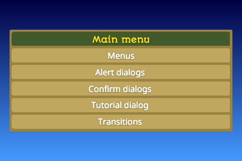

# Menus and dialogs

One of the basic things most games need is a menu and dialog system.
This repository provides a set of classes to handle the basic menus.

The menus can be displayed in game or on top of a dedicated menu
background, the demo uses a simple gradient as a background.

## Modals

A modal is a menu which is shown on top of another view, if a menu
is shown as a model then the user is required to take action. Usually 
the backgound is darkened to signify that the only available options
are on the active modal.

Every menu can be shown as a modal or a standard menu.

## Navigation

There are several different buttons to navigate trough the menus.
On the title bar there can be a back button on the left side or
a close button on the right side.

The close button is usually displayed when the menus is shown as
a modal, the back button is usually used to navigate through a menu 
tree.

Dialogs -like confirm or alert- have one or more buttons on the bottom
of the dialog.

Menus have a list of options. The standard behaviour is to hide
the menu when a menu option is clicked however it's possible to
overrule this bahaviour and let the menu persist when an option
is selected. This could be used for example to let the user select
a background which could be displayed behind the menu when an
option is selected.

## Transitions

This demo offsers several transitions to show or hide menus:
sliding, scaling, fading and rotating.

### MenuView

Inherits from
 * [ui.View](http://docs.gameclosure.com/api/ui-view.html)

Parameters
 + `superview {View}` ---The view which contains this menu, could be a menu background or the game view.
 + `title {string}` ---The title displayed in the title bar of the menu
 + `items {array}` ---A list of menu items, the structure of the item is:
  + `item {string}` ---The display title of the item
  + `action {string|function}` ---If it's a string then the value will be emitted else the function is invoked on clicking.
  + `persist {boolean}` ---Optional, If this values is `true` then the menu will not be hidden when the option is clicked.

~~~
import src.views.ui.MenuView as MenuView;

new MenuView({
	superview: this,
	title: 'Main menu',
	items: [
		{item: 'Menus', action: 'Menus'},
		{item: 'Setup', action: bind(this, 'onSetup')}
	]
}).show();
~~~

#### Methods

__show([cb])__

Parameters
 + `cb {function}` ---Optional, a callback invoked when the menu is visible.
Returns
 {object} ---Returns the reference to the menu.

__hide([cb])__

Parameters
 + `cb {function}` ---Optional, a callback invoked when the menu is hidden.
Returns
 {object} ---Returns the reference to the menu.
